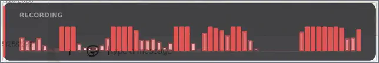

<div align="center">

# Fono

A lightweight dictation tool for Linux. Press a key, speak, and the text lands at your cursor.

[](https://github.com/bogdanr/fono/actions/workflows/ci.yml)
[](LICENSE)
[](https://github.com/bogdanr/fono/releases/latest)
[](https://fono.page)

</div>

<p align="center">
  <a href="assets/fono.webp"></a>
</p>

## Install one-liner

```sh
curl -fsSL https://fono.page/install | sh
```

The script picks the right binary for your CPU (and switches to the Vulkan-GPU build if your machine has one), runs `sudo fono install` to place it on `$PATH`, starts the daemon, and opens the `fono setup` wizard in the same terminal.

## Different styles

<p align="center">
  <a href="assets/styles.webp"></a>
</p>

While you're speaking, a small overlay shows what the microphone is hearing. Four styles ship: `bars`, `oscilloscope`, `fft`, `heatmap`. Switch via the tray (*Preferences → Waveform style*) or set `[overlay].style` in `~/.config/fono/config.toml`.

## What Fono does

- **Dictation, push-to-talk or toggle.** Tap `F7` to toggle recording; hold `F7` for push-to-talk. The same key works either way — the press duration decides.
- **Voice assistant on `F8`** Talk to Ollama, OpenAI, Anthropic, Groq, Cerebras, or OpenRouter; the reply is streamed sentence-by-sentence into TTS so audio starts before the model has finished thinking.
- **Talk to your coding agent (early preview).** Drive Forge, Claude Code, Cursor, Codex CLI, Gemini CLI — any MCP-capable agent — entirely by voice. `fono agent-setup <name>` wires it up in one shot; after that the agent speaks its replies, listens for your follow-ups, and offers A/B/C choices you pick with your voice. See [docs/coding-agents.md](docs/coding-agents.md).
- **Lands in any X11 or Wayland window.** Fono types straight into the focused window and mirrors to the clipboard as a safety net. Hotkeys register through the Wayland portal where it's available, with automatic fallbacks for GNOME 46 and X11 — see [docs/wayland.md](docs/wayland.md) for the per-compositor story.
- **Local or cloud speech-to-text.** Whisper runs on your machine by default. Or switch to Groq, OpenAI, or Deepgram with one command (`fono use stt …`).
- **Local or cloud text-to-speach.** For local you can use Wyoming-piper. More options are on the [roadmap](ROADMAP.md). Or switch to various cloud providers if you want most naturally sounding voices.
- **Automatic model selection.** The first-run wizard probes your CPU and GPU, then picks the heaviest local Whisper model that runs better than real time on your hardware — no manual tuning. The decision matrix was [engineered here][bench-page] with older and new machines accross multiple days of benchmarking.
- **Optional cleanup pass.** A small LLM can tidy up the transcript before it's injected — locally with `llama.cpp`, or via Cerebras / Groq / OpenAI / OpenRouter / Anthropic / Ollama.
- **Visualisation overlay during recording.** Bars, oscilloscope, FFT, or heatmap. Live-dictation mode adds a small VU bar.
- **Optional GPU acceleration.** `fono update` probes your host for Vulkan and pulls the matching CPU or Vulkan build automatically.
- **LAN-friendly.** Speaks the [Wyoming protocol](https://github.com/rhasspy/wyoming) as both client and server, so Fono can route through (or host for) a Home Assistant satellite or another Fono on the network. mDNS finds peers automatically.
- **Two small builds** `CPU/GPU ~22/60 MB` No Electron, no Node, no Python, no WebKit. Four glibc dependencies.

## First run

`sudo fono install` installs the files and starts the setup wizard.

Default hotkeys are `F7` (dictation) and `F8` (voice assistant). Both keys auto-detect how you press them: a quick tap toggles recording on (tap again to stop); holding for more than a second turns the key into push-to-talk and recording ends on release. `Escape` cancels a recording or shuts up an assistant reply.

The setup wizard hot-reloads the running daemon when it finishes, so you don't need to restart anything. Reconfigure with `fono setup`.

## Switching providers

`fono setup` asks for a primary cloud provider. With OpenAI or Groq, a single API key covers STT, cleanup, the assistant, and TTS. Narrower providers (Anthropic, Cerebras, OpenRouter) cover what they offer; the wizard only prompts for follow-on keys if you opt in to capabilities they don't cover.

```sh
fono use cloud groq           # paired preset (Groq STT + Groq LLM)
fono use stt openai           # change just STT
fono use tts cartesia         # swap TTS backend
fono use local                # back to whisper-local + skip polish
```

Keys live in `~/.config/fono/secrets.toml`:

```sh
fono keys add GROQ_API_KEY    # paste at the prompt
fono keys check               # reachability probe per stored key
```

TTS works with OpenAI, Groq, OpenRouter (Kokoro), Cartesia, Deepgram, and any Wyoming server you have on the LAN.

## Other ways to install

- **Distro packages.** `.deb`, `.pkg.tar.zst`, and `.txz` files are built by CI and attached to each [release](https://github.com/bogdanr/fono/releases/latest), but they are not regularly tested — they may work, please file an issue if they don't.
- **macOS and Windows.** Planned, not shipping.

## Privacy

Local-first. Nothing leaves your machine unless you pick a cloud provider.

## Documentation

- [Documentation index](docs/index.md) — the full map.
- [Install](docs/install.md) — one-liner, manual install, server mode, updating.
- [Quickstart](docs/quickstart.md) — first dictation, common follow-ups.
- [Configuration](docs/configuration.md) — every key in `config.toml`.
- [Provider matrix](docs/providers.md) — STT, polish, assistant, and TTS endpoints.
- [Live dictation](docs/interactive.md) — streaming overlay, latency budget.
- [Troubleshooting](docs/troubleshooting.md) — symptom-first recipes.
- [Roadmap](ROADMAP.md) — in progress, planned, shipped.
- Homepage: [fono.page](https://fono.page).

## Status

Linux-first; used daily by the maintainer. Rough edges exist — issues and patches are welcome. See [`ROADMAP`](ROADMAP.md) for what's next.

## Contributing

Pull requests welcome. See [`CONTRIBUTING.md`](CONTRIBUTING.md) for the workflow (DCO sign-off required).

## License

GPL-3.0-only. See [LICENSE](LICENSE).

[bench-page]: https://fono.page/calibration
